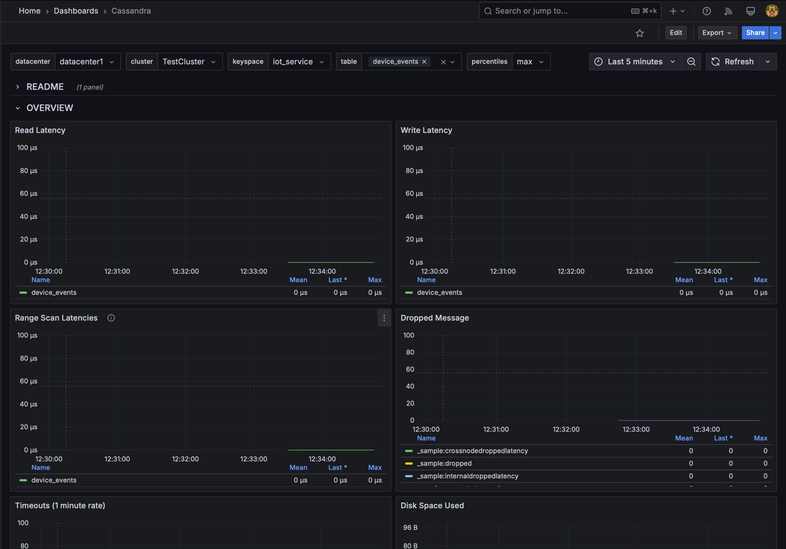
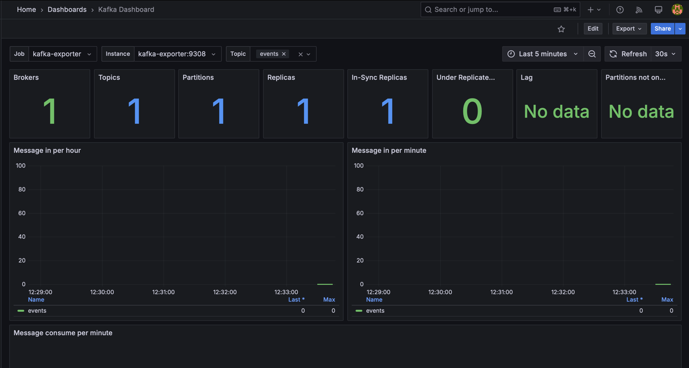
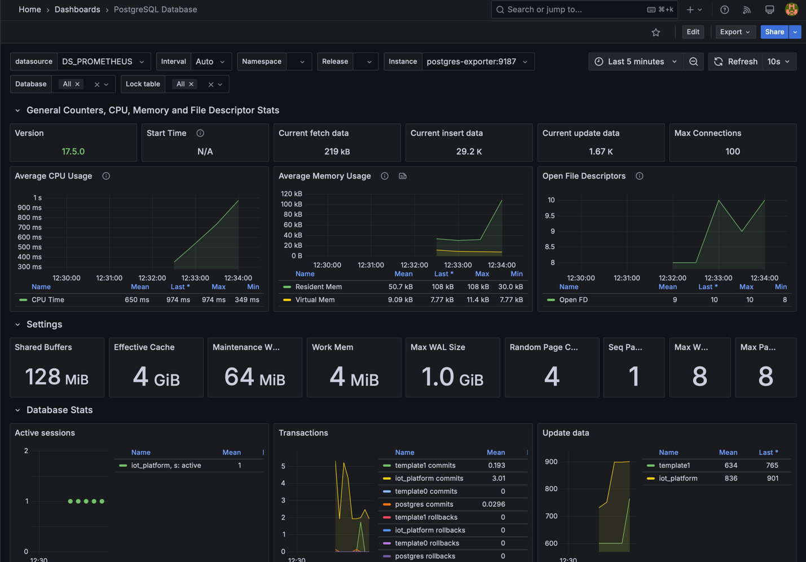
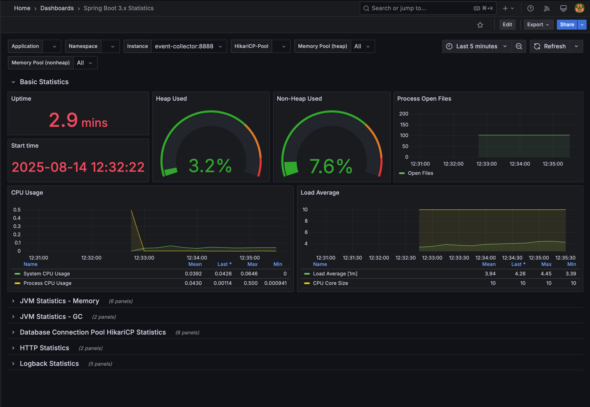
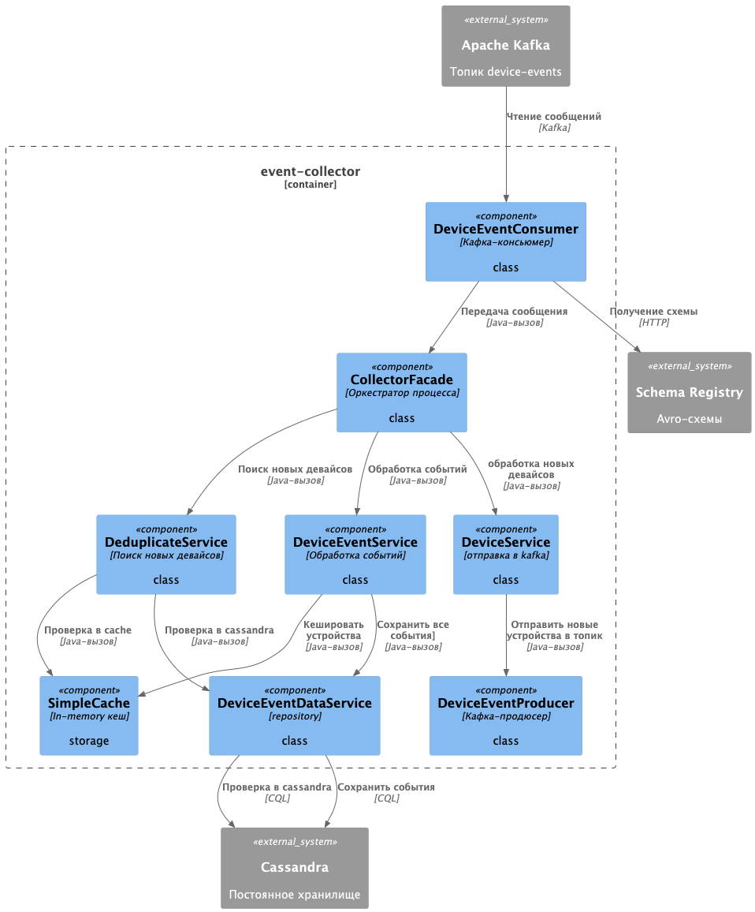
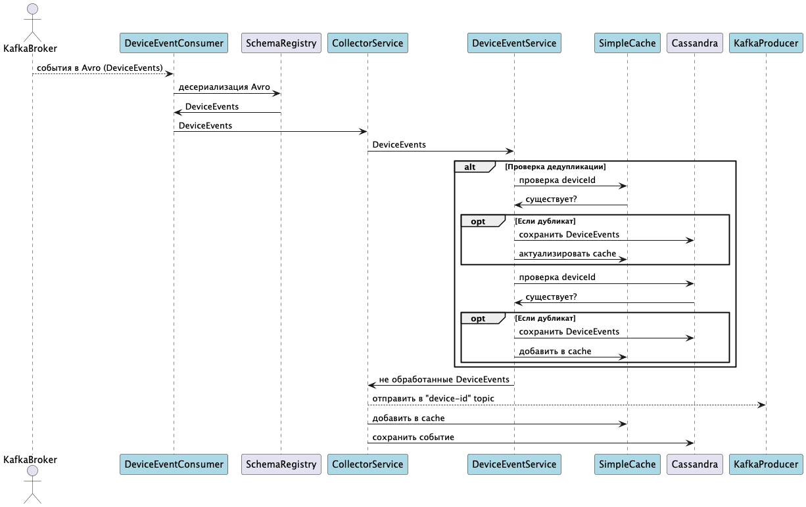

# ourcode-iot-platform

🛠 **Инфраструктура проекта** на базе Docker Compose.

---
# Быстрый старт

   ```bash
   cd ./infrastructure
   cp .env.example .env
   cd ..
   make up
```

postman collection вот тут: [postman](infrastructure/postman)

---

## 📁 Структура

- puml диаграммы в аннотации C4 можно найти в папке [diagrams](diagrams)
- инфраструктурные сервисы описаны в `docker-compose.yml`, см. папку [infrastructure](infrastructure)
- [event-collector](event-collector) сервис подписывается на kafka topic, сохраняет события в cassandra, все уникальные deviceId складывает в отдельный топик

---

## 📄 Настройка

Перед запуском необходимо:

1. Перейти в папку `infrastructure`
2. Создать файл `.env` на основе шаблона:

   ```bash
   cd ./infrastructure
   cp .env.example .env

3.	Указать все необходимые credentials и переменные окружения в .env

## 📦 Сервисы

Будет выполнен запуск следующих сервисов:

| Сервис               | Описание                                | Порт(ы) хоста   |
|----------------------|-----------------------------------------|-----------------|
| `event-collector`    | SpringBoot service сбор метрик          | `8888`          |
| `zookeeper`          | Координация Kafka                       | `2181`          |
| `kafka`              | Брокер Kafka 3.4                        | `9092`, `29092` |
| `schema-registry`    | Схемы Avro для Kafka                    | `8081`          |
| `minio`              | S3-хранилище совместимое с AWS          | `9000`, `9001`  |
| `camunda`            | BPM-платформа для бизнес-процессов      | `8088`          |
| `postgres`           | База данных PostgreSQL                  | `5432`          |
| `keycloak`           | IAM-платформа, авторизация              | `8080`          |
| `redis`              | In-memory кэш с паролем                 | `6379`          |
| `cassandra`          | NoSQL база данных                       | `9042`          |
| `grafana`            | Визуализация метрик                     | `3000`          |
| `prometheus`         | Мониторинг и сбор метрик                | `9090`          |
| `kafka-exporter`     | Экспорт метрик Kafka для Prometheus     | `9308`          |
| `cassandra-exporter` | Экспорт метрик cassandra для Prometheus | `9500`          |
| `postgres-exporter`  | Экспорт метрик postgres для Prometheus  | `9187`          |
| `kafka-ui`           | Kafka-UI для удобства просмотра         | `8099`          |

⚠️ **Важно:**  Убедитесь, что у Docker достаточно памяти и CPU. В Docker Desktop (Windows/Mac) можно выделить, например, 4+ ГБ RAM. Иначе рискуете столкнуться с тормозами или перезапусками контейнеров (особенно Java-сервисы как Keycloak могут потреблять >512МБ).

### grafana:
Доступны Dashboards с метриками 
 > [GRAFANA](http://localhost:3000) \
 > [PROMETHEUS](http://localhost:9090)

#### Скриншоты dashboard:

<details>
<summary>cassandra</summary>



</details>

<details>
<summary>kafka</summary>



</details>

<details>
<summary>postgres</summary>



</details>

<details>
<summary>spring</summary>



</details>

## 🚀 Запуск

Из корня проекта доступны команды через `Makefile`.

### 📌 Основные команды:

| Команда                       | Описание                                  |
|-------------------------------|-------------------------------------------|
| `make help`                   | вывод инфо по всем командам               |
| `make up`                     | Запуск всех сервисов                      |
| `make down`                   | Остановка и удаление всех сервисов        |
| `make restart`                | Перезапуск всех сервисов                  |
| `make restart-[name]`         | Перезапуск указанного контейнера          |
| `make logs`                   | Просмотр логов всех сервисов              |
| `make logs-[name]`            | Просмотр логов конкретного сервиса        |
| `make exec-[name]`            | Зайти в контейнер                         |
| `make set-log-[level]-[port]` | Установить логирование                    |
| `make update-<service>`       | Пересобрать проект и развернуть контейнер |

### 🔍 Примеры:

<pre>
make up                # запуск всех сервисов
make logs-kafka        # логи только Kafka
make down              # остановка всех сервисов
</pre>

# Описание сервисов

## event-collector

### Процесс

- подписывается на Kafka-топик events,
- получает события в формате Avro (валидация через Schema Registry),
- сохраняет события в Apache Cassandra для аналитики,
- публикует уникальные device_id в отдельный Kafka-топик device-id.

<details>

<summary>Компоненты сервиса</summary>



</details>

<details>

<summary>Логическая последовательность</summary>



</details>

### Технологии:
- Язык программирования: Java 24
- Фреймворк: Spring Boot 3.5
- Обмен сообщениями: Apache Kafka
- Сериализация: Avro (Confluent Schema Registry)
- Хранилище: Apache Cassandra
- Тестирование и окружение: Testcontainers (Kafka, Cassandra, Schema Registry)
- Система сборки: Gradle
