# iot-platform

🛠 **Инфраструктура проекта** на базе Docker Compose.

---

# Быстрый старт (deploy)

- Разворачивает всю систему локально в docker контейнерах
- Настраивает роли для keycloak и nexus
- Публикует API клиент в nexus

```bash
   cd ./infrastructure
   cp .env.example .env
   cd ..
   make up
```

postman коллекция тут: [postman](infrastructure/postman)

---

## 📁 Структура

- puml диаграммы в аннотации C4 можно найти в папке [diagrams](diagrams)
- инфраструктурные сервисы описаны в `docker-compose.yml`, см. папку [infrastructure](infrastructure)
- [kafka-producer](kafka-producer) технический сервис для тестирования. Умеет выдавать JWT для device-service и
  orchestrator, умеет
  генерировать события в топик events
- [event-collector](event-collector) сервис подписывается на kafka topic events, сохраняет события в cassandra, все
  уникальные deviceId складывает в отдельный топик devices
- [device-collector](device-collector) сервис подписывается на kafka topic devices, сохраняет их в postgres,
  шардированную по deviceId
- [device-service](device-service) сервис для CRUD операций с Device, подключен к в postgres, шардированной по deviceId.
  Защищен через keycloak. Есть redis.
- [event-service](event-service) сервис для получения собыий из cassndra собранных event-collector
- [orchestrator](orchestrator) оркестрация для работы бизнес кейсов с системой; Получить список устройств, событий,
  отправить команды на устройство;
- [router-manager-service](router-manager-service) сервис для взаимодействия с устройствами. Отправляет команды, хранит
  статусы команд
- [router](router) пример логики устройства. С заданным периодом отправляет события в kafka, принимает команды от
  router-manager-service

Общая схема: 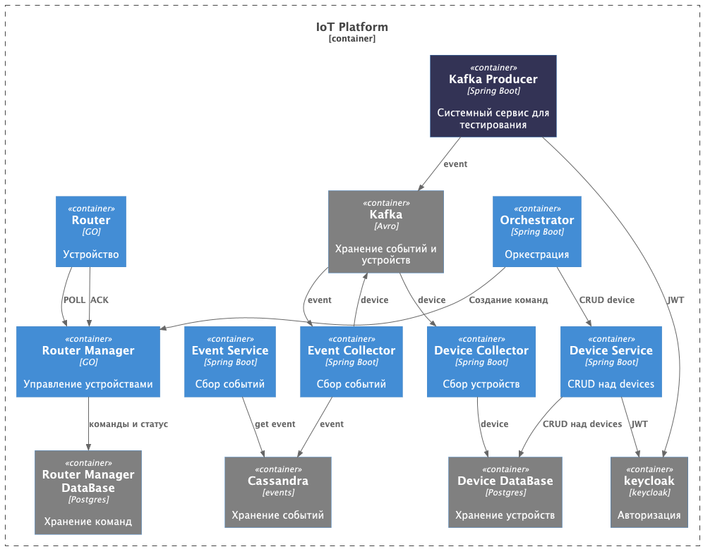

---

## 📄 Настройка

Перед запуском необходимо:

1. Перейти в папку `infrastructure`
2. Создать файл `.env` на основе шаблона:

   ```bash
   cd ./infrastructure
   cp .env.example .env

3.	Указать все необходимые credentials и переменные окружения в .env

## 📦 Сервисы

Будет выполнен запуск следующих сервисов:

| Сервис                    | Описание                                           | Порт(ы) хоста  |
|---------------------------|----------------------------------------------------|----------------|
| `orchestrator`            | SpringBoot service для оркестрации (бизнес логика) | `8879`         |
| `kafka-producer`          | SpringBoot service для тестирования                | `8887`         |
| `router`                  | GO service имитация устройства                     | -              |
| `router-manager-service`  | GO service для работы с устройствами               | `8890`, `8891` |
| `failed-events-processor` | SpringBoot service для обработки сообщений в DLT   | `8880`         |
| `event-collector`         | SpringBoot service сбор метрик в cassandra         | `8888`         |
| `device-collector`        | SpringBoot service сбор device в postgress         | `8889`         |
| `device-service`          | SpringBoot service CRUD device в postgress         | `8886`         |
| `zookeeper`               | Координация Kafka                                  | `2181`         |
| `kafka`                   | Брокер Kafka 3.4                                   | `9092`         |
| `schema-registry`         | Схемы Avro для Kafka                               | `8081`         |
| `minio`                   | S3-хранилище совместимое с AWS                     | `9000`, `9001` |
| `camunda`                 | BPM-платформа для бизнес-процессов                 | `8088`         |
| `postgres1`               | База данных PostgreSQL master 1                    | `5431`         |
| `postgres2`               | База данных PostgreSQL master 2                    | `5432`         |
| `postgres1r`              | База данных PostgreSQL replica 1                   | `5433`         |
| `postgres2r`              | База данных PostgreSQL replica 2                   | `5434`         |
| `postgres_router_manager` | База данных PostgreSQL router-manager-service      | `5439`         |
| `postgres-keycloak`       | База данных PostgreSQL для keycloak                | `5430`         |
| `keycloak`                | IAM-платформа, авторизация                         | `8080`         |
| `redis`                   | In-memory кэш с паролем                            | `6379`         |
| `redis-insight`           | UI для redis                                       | `6379`         |
| `cassandra`               | NoSQL база данных                                  | `9042`         |
| `grafana`                 | Визуализация метрик                                | `3000`         |
| `prometheus`              | Мониторинг и сбор метрик                           | `9090`         |
| `kafka-exporter`          | Экспорт метрик Kafka для Prometheus                | `9308`         |
| `cassandra-exporter`      | Экспорт метрик cassandra для Prometheus            | `9500`         |
| `postgres-exporter`       | Экспорт метрик postgres для Prometheus             | `9187`         |
| `kafka-ui`                | Kafka-UI для удобства просмотра                    | `8099`         |

⚠️ **Важно:**  Убедитесь, что у Docker достаточно памяти и CPU. В Docker Desktop (Windows/Mac) можно выделить, например, 4+ ГБ RAM. Иначе рискуете столкнуться с тормозами или перезапусками контейнеров (особенно Java-сервисы как Keycloak могут потреблять >512МБ).

### grafana:
Доступны Dashboards с метриками 
 > [GRAFANA](http://localhost:3000) \
 > [PROMETHEUS](http://localhost:9090)

#### Скриншоты dashboard:

<details>
<summary>cassandra</summary>


</details>

<details>
<summary>kafka</summary>


</details>

<details>
<summary>postgres</summary>


</details>

<details>
<summary>spring</summary>


</details>

<details>
<summary>minio</summary>

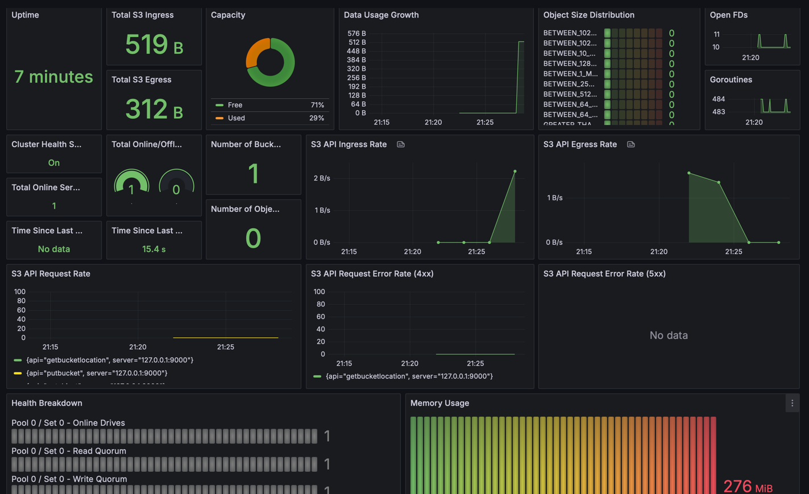

</details>

<details>
<summary>device-events-metrics</summary>

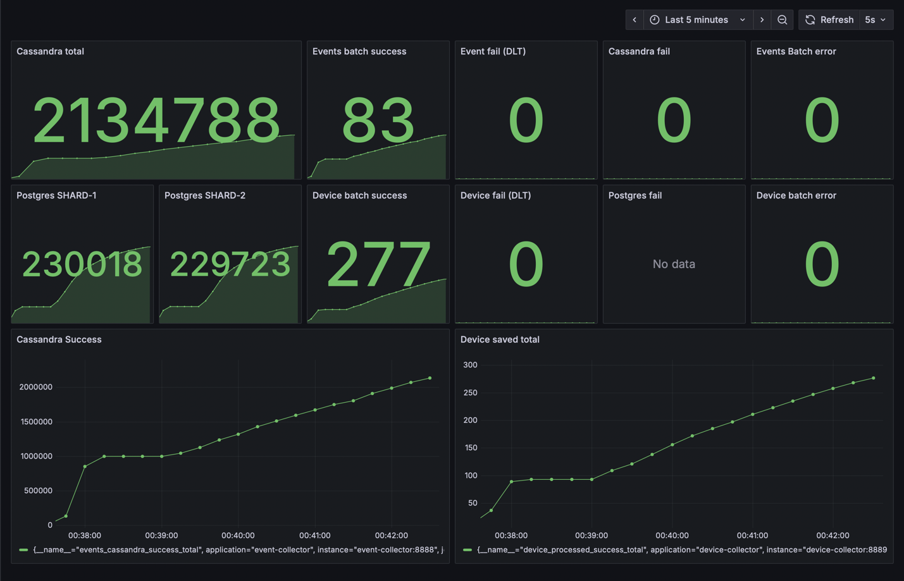

</details>

<details>
<summary>device-service-metrics</summary>

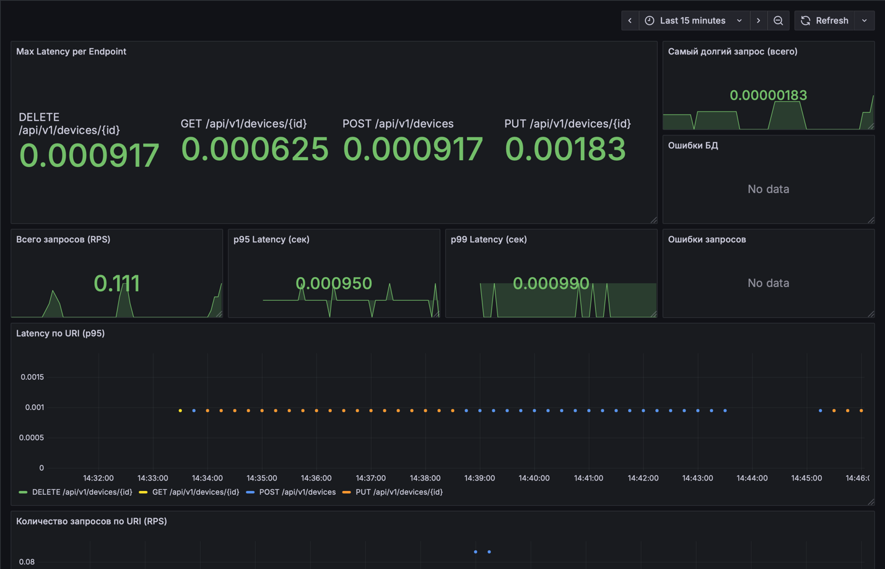

</details>

<details>
<summary>router-manager-service</summary>

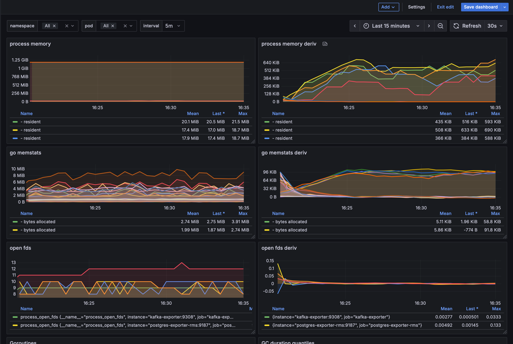

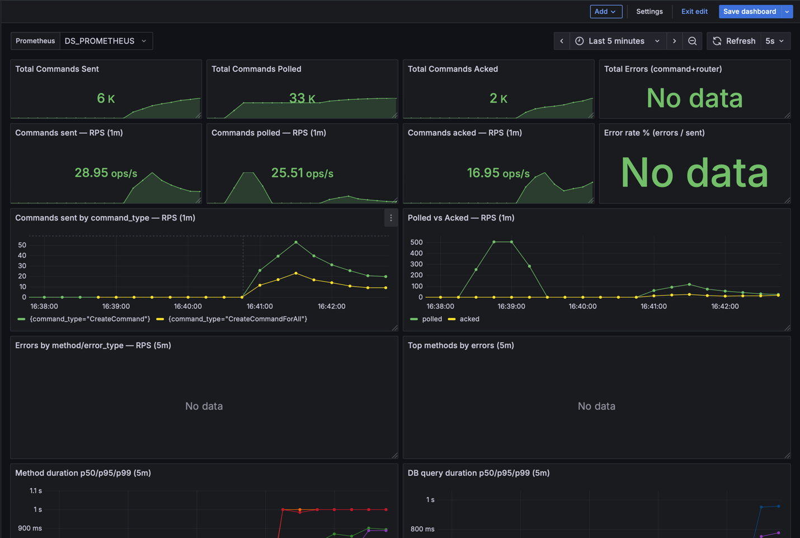


</details>

## 🚀 Запуск

Из корня проекта доступны команды через `Makefile`.

Справка:

   ```bash
   make help
   ```

# Описание сервисов

## event-collector

### Процесс

- подписывается на Kafka-топик events,
- получает события в формате Avro (валидация через Schema Registry),
- сохраняет события в Apache Cassandra для аналитики,
- публикует уникальные deviceid в отдельный Kafka-топик device.

<details>

<summary>Компоненты сервиса</summary>


</details>

<details>

<summary>Логическая последовательность</summary>


</details>

### Технологии:
- Язык программирования: Java 24
- Фреймворк: Spring Boot 3.5
- Обмен сообщениями: Apache Kafka
- Сериализация: Avro (Confluent Schema Registry)
- Хранилище: Apache Cassandra
- Тестирование и окружение: Testcontainers (Kafka, Cassandra, Schema Registry)
- Система сборки: Gradle

## event-service

### Процесс

- Подключается к cassandra;
- Получает события по заданным в запросе критериям

API: [event-api.yml](event-service/src/main/resources/openapi/event-api.yml)

<details>

<summary>Компоненты сервиса</summary>

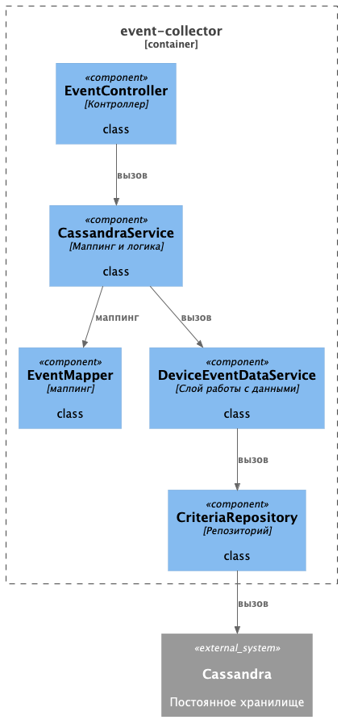

</details>

<details>

<summary>Логическая последовательность</summary>

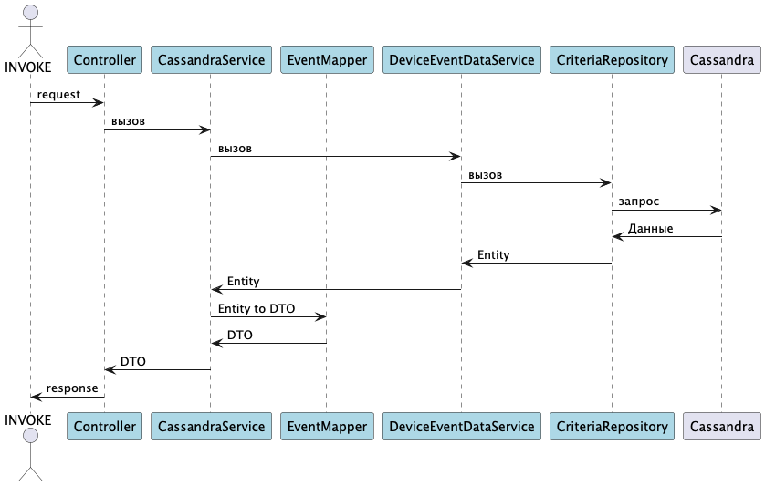

</details>

### Технологии:
- Язык программирования: Java 24
- Фреймворк: Spring Boot 3.5
- Обмен сообщениями: REST
- Хранилище: Apache Cassandra
- Тестирование и окружение: Testcontainers (Kafka, Cassandra, Schema Registry)
- Система сборки: Gradle

## device-collector

- получает сообщения о новых и изменённых устройствах из Kafka в формате Avro (валидация через Schema Registry)
- cохраняет/обновляет информацию о устройствах в PostgreSQL, используя шардирование через Apache ShardingSphere
- Гарантирует идемпотентность, корректную обработку ошибок, экспортирует метрики.

<details>

<summary>Компоненты сервиса</summary>

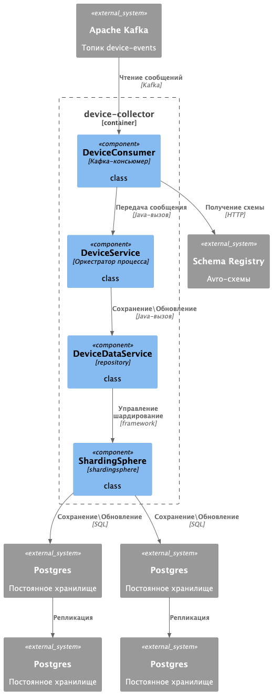

</details>

<details>

<summary>Логическая последовательность</summary>

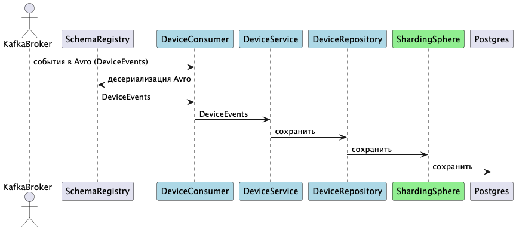

</details>

### Технологии:
- Язык программирования: Java 24
- Фреймворк: Spring Boot 3.5
- Обмен сообщениями: Apache Kafka
- Сериализация: Avro (Confluent Schema Registry)
- Шардирование: ShardingSphere
- Хранилище: Postgres
- Тестирование и окружение: Testcontainers (Kafka, Postgres, Schema Registry)
- Система сборки: Gradle

## device-service

- все endpoint защищены keycloak
- СRUD операции на устройствами в PostgreSQL, используя шардирование через Apache ShardingSphere
- между приложение и базой есть redis
- экспортирует метрики

<details>

<summary>Компоненты сервиса</summary>

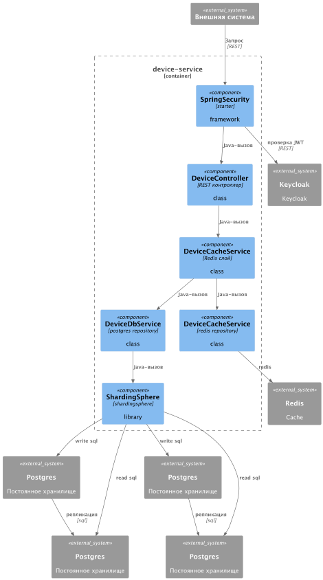

</details>

<details>

<summary>Логическая последовательность</summary>

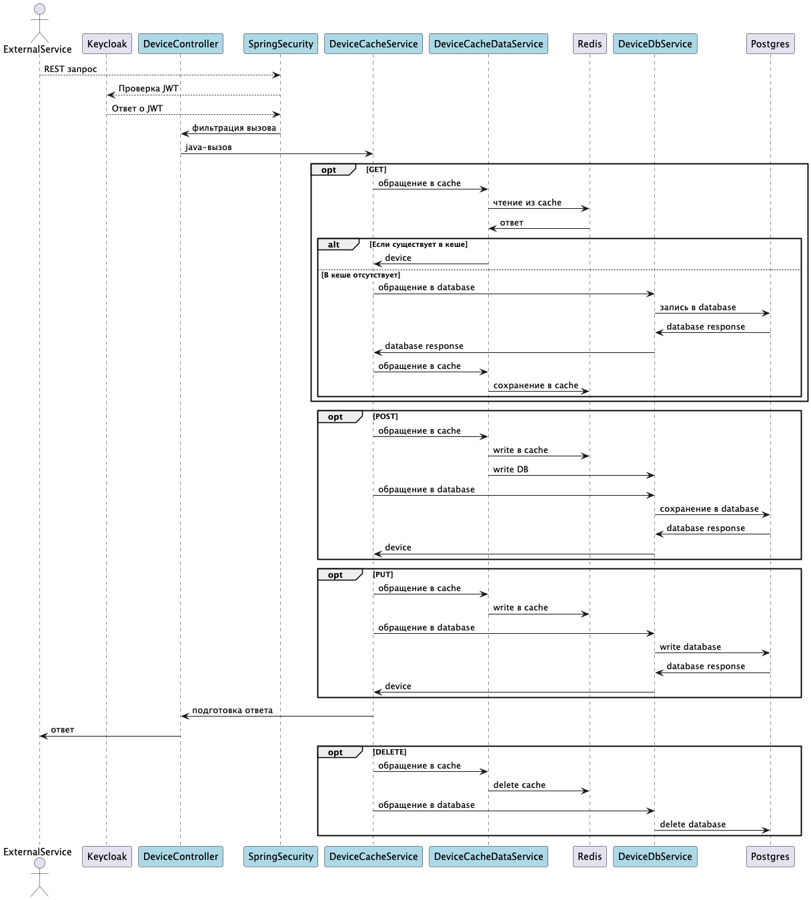

</details>

### Технологии:
- Язык программирования: Java 24
- Фреймворк: Spring Boot 3.5
- Обмен сообщениями: REST
- Шардирование: ShardingSphere
- Хранилище: Postgres
- Тестирование и окружение: Testcontainers (Postgres, Redis, Keycloak)
- Система сборки: Gradle

<details>

<summary>
дополнительная информация
</summary>

### API Documentation

OpenAPI спецификация: [DeviceV1Api.pdf](infrastructure/api/DeviceV1Api.pdf)

Для отправки запросов на end-point согласно спецификации, необходимо создать JWT токен, для
этого есть отдельный endPoint в [kafka-producer](kafka-producer)
> http://localhost:8887/auth/token?login=admin&password=admin \
> эти и другие запросы есть в [postman](infrastructure/postman)

</details>

## failed-events-processor

- Подписывается на Kafka Dead Letter Topic (DLT) и получает сообщения о событиях, которые не удалось обработать другими
  сервисами.
- Формирует на основе этих сообщений структурированные JSON-файлы.
- Сохраняет полученные JSON-файлы в объектное хранилище MinIO.
- Экспортирует метрики и healthcheck для мониторинга.

<details>

<summary>Компоненты сервиса</summary>

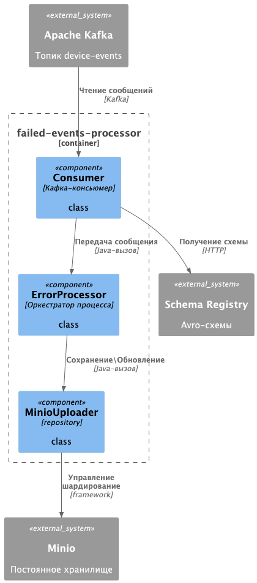

</details>

<details>

<summary>Логическая последовательность</summary>

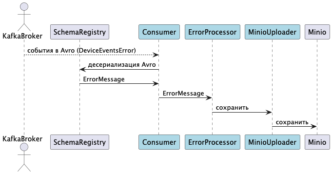

</details>

### Технологии:

- Язык программирования: Java 24
- Фреймворк: Spring Boot 3.5
- Обмен сообщениями: Kafka
- Хранилище: Minio
- Тестирование и окружение: Testcontainers (Kafka, Minio)
- Система сборки: Gradle

## router-manager-service

gRPC API на Go:

- Позволяет отправлять команды одному или всем роутерам.
- Сохраняет команды и статус их обработки в PostgreSQL.
- Отдаёт роутерам команды по их router_id по запросу.
- Принимает подтверждение выполнения команд от роутеров

<details>

<summary>Компоненты сервиса</summary>

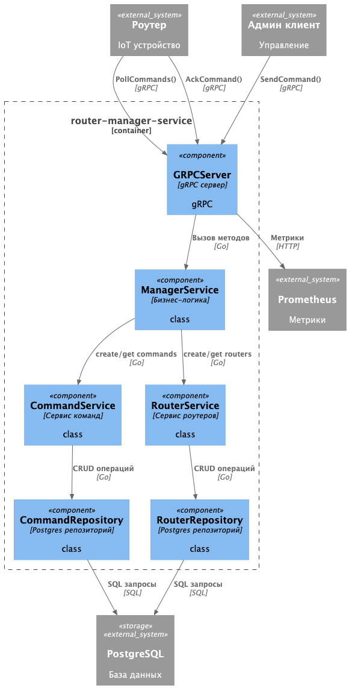[router-manager-service-component.puml](diagrams/router-manager-service/router-manager-service-component.puml)

</details>

<details>

<summary>Логическая последовательность</summary>

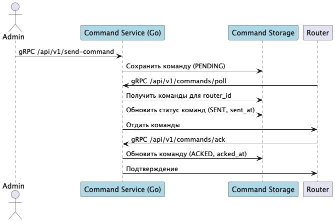

</details>

### Технологии:

- Язык программирования: Go 1.25
- gRPC API с namespace /api/v1
- Хранилище: PostgreSQL (подключение через pgx)
- Тестирование и окружение: Testcontainers (PostgreSQL)

proto можно найти тут [roma.proto](router-manager-service/protobuf/roma.proto)

jmeter .JMX брать тут: [router-manager-service.jmx](infrastructure/jmeter/router-manager-service.jmx)
